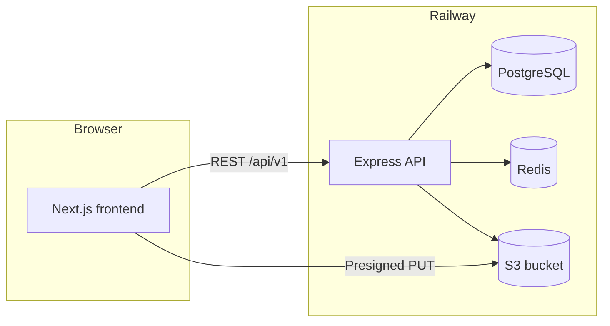

# TalentSpring Job Portal

TalentSpring is a full-stack job portal where candidates search and apply for roles, recruiters manage companies and hiring pipelines, and platform administrators oversee users and verification. The repository is a monorepo with a **Next.js** frontend and an **Express/TypeScript** API backed by **PostgreSQL**, **Redis**, and **S3-compatible** object storage.

---

## Live deployment (Railway)

| Resource | URL |
|----------|-----|
| **Web app** | [https://frontend-production-2d95.up.railway.app](https://frontend-production-2d95.up.railway.app) |
| **API base** | [https://api-production-3246e.up.railway.app/api/v1](https://api-production-3246e.up.railway.app/api/v1) |
| **API health** | [https://api-production-3246e.up.railway.app/health/readiness](https://api-production-3246e.up.railway.app/health/readiness) |
| **Swagger UI** | [https://api-production-3246e.up.railway.app/docs](https://api-production-3246e.up.railway.app/docs) |
| **Railway project** | [Dashboard — talent-spring](https://railway.com/project/bbe94dd7-3d84-4b1c-90f9-80fcc2fe63bc) |

Production stack on Railway:

- **frontend** — Next.js 16 (App Router)
- **api** — Express API (includes BullMQ email worker in the same process)
- **Postgres** — application database (Prisma migrations on container start)
- **Redis** — rate limiting, refresh-token revocation, job queue
- **uploads** — Railway storage bucket (resumes and logos via presigned URLs)

To redeploy or reproduce infrastructure locally with the CLI, see [Railway deployment](#railway-deployment) below.

---

## What the application does

### Candidates

- Register and sign in with JWT access tokens and HTTP-only refresh cookies
- Build a profile, upload PDF/DOCX resumes (direct upload to object storage)
- Search and filter jobs, save roles, apply with cover letters
- Track application status, notifications, and scheduled interviews

### Recruiters

- Create and manage company profiles
- Post, publish, pause, and close jobs
- Review applicants, add private notes, move candidates through pipeline stages
- Download authorized resumes and schedule interviews

### Administrators

- Platform overview metrics
- User status management
- Company verification
- Audit log review

---

## Architecture



| Layer | Technology |
|-------|------------|
| Frontend | Next.js 16, React 19, TanStack Query, Zustand, Tailwind CSS |
| API | Express, TypeScript, Zod validation, Pino logging |
| Data | Prisma ORM, PostgreSQL 16 |
| Cache & queue | Redis 7, BullMQ (notification emails) |
| Files | AWS SDK v3, S3-compatible storage (SeaweedFS locally, Railway bucket in production) |
| Email | SendGrid (optional; skipped if `SENDGRID_API_KEY` is unset) |

**API layout:** Routes live under `/api/v1`. Health checks are at `/health/liveness` and `/health/readiness` (no API prefix). Backend modules: `auth`, `companies`, `profiles`, `jobs`, `applications`, `notifications`, `admin`, `uploads`.

**Auth:** Short-lived Bearer access token (15 minutes) plus a 7-day refresh token stored in Redis (SHA-256 hash) and delivered as an HTTP-only cookie. The frontend `apiFetch` helper refreshes once on 401.

**Uploads:** The API issues presigned URLs; the browser uploads files directly to object storage, not through the API body.

---

## Repository structure

```
.
├── frontend/          Next.js App Router UI
├── backend/           Express API, Prisma schema & migrations, worker
├── docker-compose.yml Local full stack (Postgres, Redis, SeaweedFS, API, worker, frontend)
├── .env.example       Root env template for Docker Compose
├── .railway/          Railway Infrastructure-as-Code (optional)
├── scripts/           deploy-railway.sh and other helpers
├── DEPLOYMENT.md      Vercel + container host deployment notes
└── AGENTS.md          Contributor / agent command reference
```

**Frontend routes (high level):** `/`, `/jobs`, `/companies`, `/login`, `/register`, candidate area under `/candidate/*`, recruiter under `/recruiter/*`, admin at `/admin/dashboard`.

**Database:** Schema in `backend/prisma/schema.prisma`; ER diagram in [backend/prisma/ERD.md](backend/prisma/ERD.md) (`cd backend && npm run db:erd` to regenerate).

---

## Run locally (Docker — recommended)

**Requirements:** Docker Compose (or Podman Compose), ~4 GB free memory.

```sh
cp .env.example .env
# Edit .env: set JWT_ACCESS_SECRET and JWT_REFRESH_SECRET (each ≥ 32 characters)

docker compose up --build -d
docker compose exec api_backend npm run db:seed
```

| Service | URL |
|---------|-----|
| Web app | http://localhost:3000 |
| API | http://localhost:5000/api/v1 |
| Swagger | http://localhost:5000/docs |
| Local S3 | http://localhost:9000 |

The Compose stack runs a **separate** `email_worker` service. On Railway, the API container starts the email worker inside the same process.

---

## Run locally (without app containers)

Use infrastructure containers only, then run Node processes on the host:

```sh
cp .env.example backend/.env
echo 'NEXT_PUBLIC_API_URL=http://localhost:5000/api/v1' > frontend/.env.local

docker compose up -d postgres_db redis_cache object_storage

cd backend
npm ci
npm run db:generate
npm run db:migrate
npm run db:seed
```

In **three terminals**:

```sh
cd backend && npm run dev
cd backend && npm run worker    # required for email delivery
cd frontend && npm ci && npm run dev
```

---

## Demo accounts (after seeding)

All seeded accounts use `SEED_PASSWORD` from `.env` (default **`JobPortal123!`**). Use the same password on the live Railway app if the database was seeded there.

| Role | Email |
|------|--------|
| Admin | `admin@jobportal.com` |
| Recruiters | `recruiter1@jobportal.com` … `recruiter4@jobportal.com` |
| Candidates | `candidate1@jobportal.com` … `candidate5@jobportal.com` |

**Do not** run `db:seed` against production data you care about; seed is for development and demos only.

Set `SENDGRID_API_KEY` and `EMAIL_FROM` to enable outbound notification emails. Without SendGrid, in-app notifications still work and the worker logs `email_skipped`.

---

## Environment variables

Copy from [.env.example](.env.example). Important keys:

| Variable | Used by | Purpose |
|----------|---------|---------|
| `DATABASE_URL` | API | PostgreSQL connection string |
| `REDIS_URL` | API, worker | Redis for limits, tokens, BullMQ |
| `JWT_ACCESS_SECRET`, `JWT_REFRESH_SECRET` | API | Signing keys (≥ 32 chars each) |
| `FRONTEND_URL` | API | CORS and refresh-cookie context |
| `S3_*`, `AWS_*` | API | Object storage for uploads |
| `SENDGRID_API_KEY`, `EMAIL_FROM` | API / worker | Optional email |
| `NEXT_PUBLIC_API_URL` | Frontend | Browser → API |
| `API_INTERNAL_URL` | Frontend | Server-side fetches (SSR) |

Never commit `.env` files. Use your host’s secret manager in production.

---

## Development commands

**Backend** (`backend/`):

```sh
npm run dev              # API with hot reload
npm run worker           # Email worker (local Docker uses a dedicated container)
npm run typecheck
npm run build
npm test                 # Unit tests
npm run test:integration # Needs Postgres + Redis
npm run db:generate
npm run db:migrate       # Dev: creates migration files
npm run db:deploy        # Prod: apply committed migrations only
npm run db:seed
```

**Frontend** (`frontend/`):

```sh
npm run dev
npm run build
npm run typecheck
npm run test:e2e         # Playwright; needs full seeded stack + Chromium
```

---

## Testing and CI

- **Unit:** `cd backend && npm test`
- **Integration:** Start Postgres and Redis, then `cd backend && npm run test:integration`
- **E2E:** Full stack seeded, `cd frontend && npx playwright install chromium && npm run test:e2e`

GitHub Actions runs typecheck, builds, unit tests, integration tests, and the Playwright hiring-flow scenario when configured in the workflow.

---

## Deployment

### Railway (current production)

Live URLs are in [Live deployment (Railway)](#live-deployment-railway). Infrastructure can be managed with:

- [`.railway/railway.ts`](.railway/railway.ts) — project definition (Postgres, Redis, bucket, api, frontend)
- [`scripts/deploy-railway.sh`](scripts/deploy-railway.sh) — CLI helper after `npx @railway/cli login`

Typical flow:

```sh
npx @railway/cli login
npx @railway/cli link          # if not already linked to talent-spring
./scripts/deploy-railway.sh    # or deploy services individually with railway up
```

Seed production demo data only when appropriate:

```sh
npx @railway/cli ssh config --service api -i ~/.ssh/id_ed25519
ssh railway-api 'SEED_PASSWORD=JobPortal123! npm run db:seed'
```

### Other hosts

For splitting **Vercel (frontend)** and **container-hosted API + worker**, see [DEPLOYMENT.md](DEPLOYMENT.md). For step-by-step managed Postgres/Redis/R2 setups, see [DEPLOYMENT_GUIDE.md](DEPLOYMENT_GUIDE.md).

Production checklist:

1. Strong JWT secrets and managed Postgres, Redis, and object storage  
2. `npm run db:deploy` (or migrate on start) before serving traffic  
3. `FRONTEND_URL` matches the real browser origin (HTTPS)  
4. Bucket CORS allows the frontend origin for direct uploads  
5. Health checks on `/health/readiness` and `/health/liveness`

---

## API reference

- **Swagger UI:** [Production docs](https://api-production-3246e.up.railway.app/docs) or `http://localhost:5000/docs` locally  
- **OpenAPI JSON:** `/docs/openapi.json` on the API host  

---

## License and contributing

This project is maintained as an application portfolio / learning codebase. For agent-oriented commands and conventions, see [AGENTS.md](AGENTS.md). For the long-form design spec, see [architecture.txt](architecture.txt).
